# Buildly - AI Website & PPT Generator Platform

## Project Review Documentation

***

## 1. Introduction

**Buildly** is an innovative AI-powered SaaS platform that revolutionizes the way users create websites and PowerPoint presentations. Built with cutting-edge technology, Buildly leverages Google's Gemini AI to instantly transform user ideas into fully functional websites and professional presentations.

### Project Overview

* **Platform Name**: Buildly

* **Type**: AI-powered SaaS Platform

* **Primary Function**: Instant website and PowerPoint presentation generation

* **Target Users**: Entrepreneurs, small businesses, students, professionals, and content creators

* **Technology Stack**: Next.js 15, React 19, TypeScript, Tailwind CSS, Google Generative AI

### Key Value Proposition

Buildly eliminates the traditional barriers of web development and presentation design by allowing users to simply describe their ideas in natural language. The AI then generates complete, professional-grade websites and presentations in seconds, not hours or days.

### Problem Statement

* Traditional website development requires technical expertise and significant time investment

* Creating professional presentations is time-consuming and requires design skills

* Small businesses and individuals lack resources for professional web development

* Existing solutions are either too complex or produce low-quality results

### Solution

Buildly provides an intuitive, AI-driven platform that:

* Generates complete websites from text descriptions

* Creates professional PowerPoint presentations instantly

* Offers customization options for branding and styling

* Provides a seamless user experience with modern UI/UX design

***

## 2. Description of Modules

### 2.1 Main Components

#### **🏠 Landing Page**

* Beautiful animated homepage

* Shows features and pricing

* User signup/login

#### **🔐 Authentication**

* User registration and login

* Secure password management

* Session handling

#### **📊 Dashboard**

* Main control panel

* Generate websites and PPTs

* View project history

#### **🎨 Website Generator**

* AI creates websites from text

* Multiple templates available

* Instant HTML/CSS generation

#### **📋 PPT Generator**

* AI creates presentations

* Auto-adds relevant images

* Download as PowerPoint file

#### **💰 Pricing System**

* Free and paid plans

* Stripe payment integration

* Feature limitations by plan

***

## 3. Data Flow Diagram

### Level 0 - Context Diagram (Simple Overview)

```mermaid
graph LR
    User[👤 User] -->|Ideas & Requests| Buildly[🏗️ Buildly System]
    Buildly -->|Websites & PPTs| User
    Buildly <-->|AI Processing| AI[🤖 AI Service]
```



### Level 1 - Main Process Flow (3 Simple Steps)

```mermaid
graph TD
    User[👤 User]
    
    P1[1️⃣ Login Process]
    P2[2️⃣ Generate Content]
    P3[3️⃣ Download Process]
    
    User -->|Username & Password| P1
    P1 -->|Access Granted| P2
    P2 -->|Content Ready| P3
    P3 -->|Files| User
```



### Level 2 - Generate Content Details (What Gets Created)

```mermaid
graph TD
    P2[2️⃣ Generate Content]
    
    W[🌐 Website Generation]
    PPT[📄 PPT Generation]
    
    P2 --> W
    P2 --> PPT
    
    W -->|HTML/CSS Files| Output[📁 Ready Files]
    PPT -->|PowerPoint Files| Output
```



### Process Descriptions

* **P1: User Authentication** - Handles login/signup and session management

* **P2: Website Generation** - Processes AI requests to generate website code

* **P3: PPT Generation** - Creates PowerPoint presentations using AI

* **P4: Content Management** - Manages user content and generated files

### Data Store Descriptions

* **D1: User Database** - Stores user accounts, profiles, and authentication data

* **D2: Templates Store** - Contains website and PPT templates library

* **D3: Generated Content** - Stores all user-generated websites and presentations

***

***

## 4. Conclusion

### ✅ What We Built

* **AI Website Generator** - Creates websites from simple text

* **PPT Generator** - Makes presentations automatically

* **User System** - Login, dashboard, and project management

* **Modern Design** - Beautiful animations and responsive layout

### 🛠️ Technology Used

* **Frontend**: Next.js, React, Tailwind CSS

* **AI**: Google Gemini AI

* **Database**: Supabase

* **Payments**: Stripe

### 🎯 Key Features

* Generate websites instantly

* Create PowerPoint presentations

* User authentication and profiles

* Multiple pricing plans

* Template library

* Mobile-friendly design

### 🚀 Project Success

Buildly successfully makes website and presentation creation easy for everyone. Users can now create professional content in minutes instead of hours, without needing technical skills.

***

**Document Prepared for Project Review**\
**Date**: \[Current Date]\
**Platform**: Buildly - AI Website & PPT Generator\
**Version**: 1.0.0

```
```

